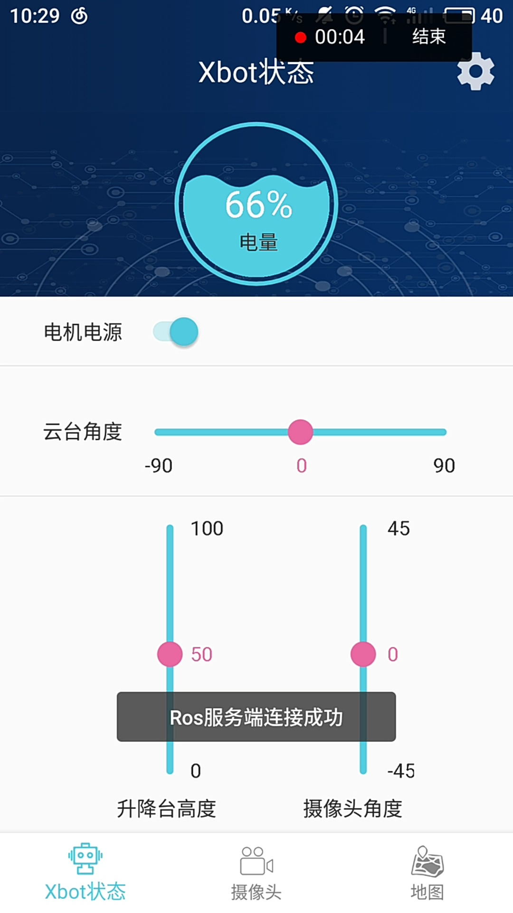
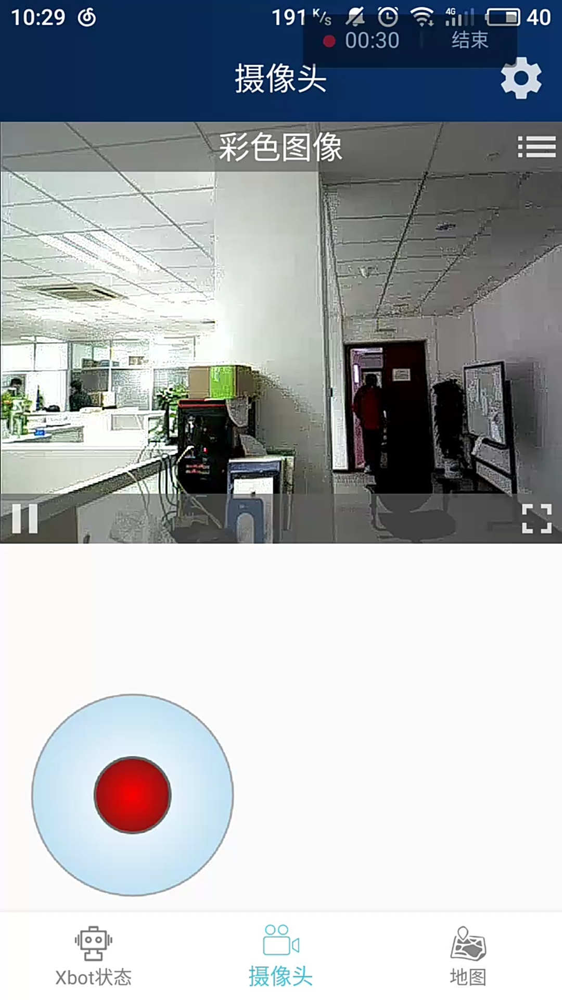
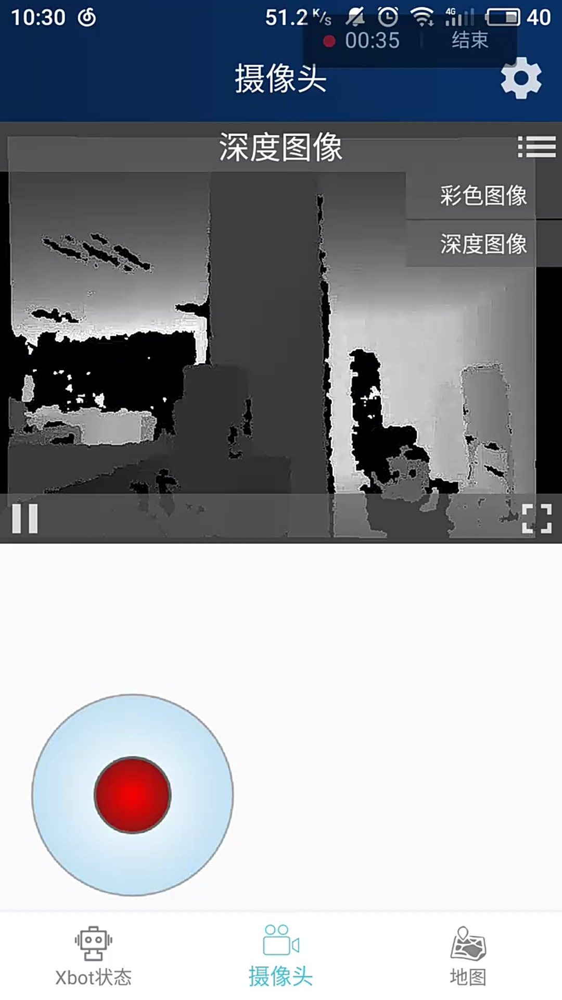
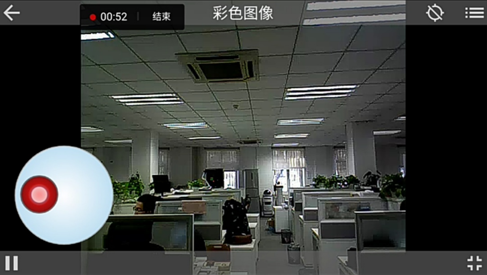
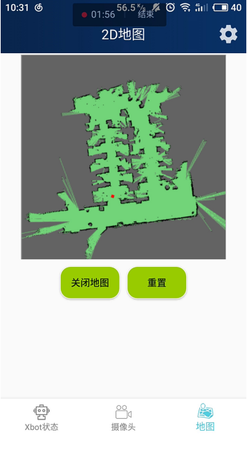

# Xbot Player   

XbotPlayer is an Android application which is the controller of [Xbot Robot](http://robots.ros.org/xbot/) .

Features:

* Movement and state control of  [Xbot Robot](http://robots.ros.org/xbot/)  .
* It can play color and depth live video stream of camera in xbot.   
* 2D map of real time scene.

GitLab:https://yt.droid.ac.cn/beijing/ros-map-view

## ScreeenShot:

Xbot state page:

Color images of the camera in Xbot:

Depth images of the camera in Xbot:

Full-screen mode of the camera video player.

The 2D map in part of our office.

