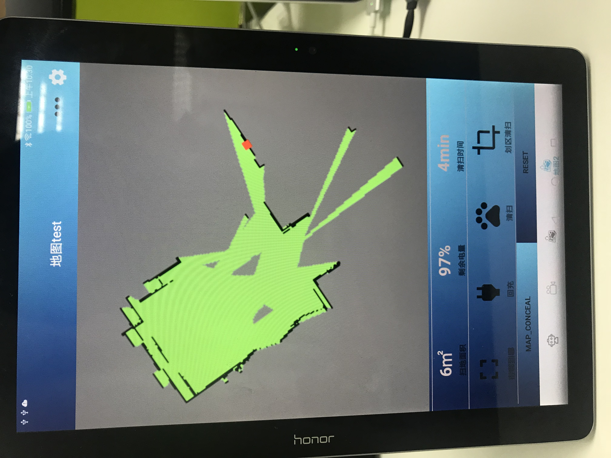

# xbotPlayer-master
中科院软件研究所-Xbot机器人player-Android交互端
Xbot Player

XbotPlayer is an Android application which is the controller of Xbot Robot .

Features:

Movement and state control of  Xbot Robot  .
It can play color and depth live video stream of camera in xbot.

2D map of real time scene.

GitLab:https://yt.droid.ac.cn/beijing/ros-map-view

ScreeenShot:

Xbot state page:

Color images of the camera in Xbot:

Depth images of the camera in Xbot:

Full-screen mode of the camera video player.

The 2D map in part of our office.

